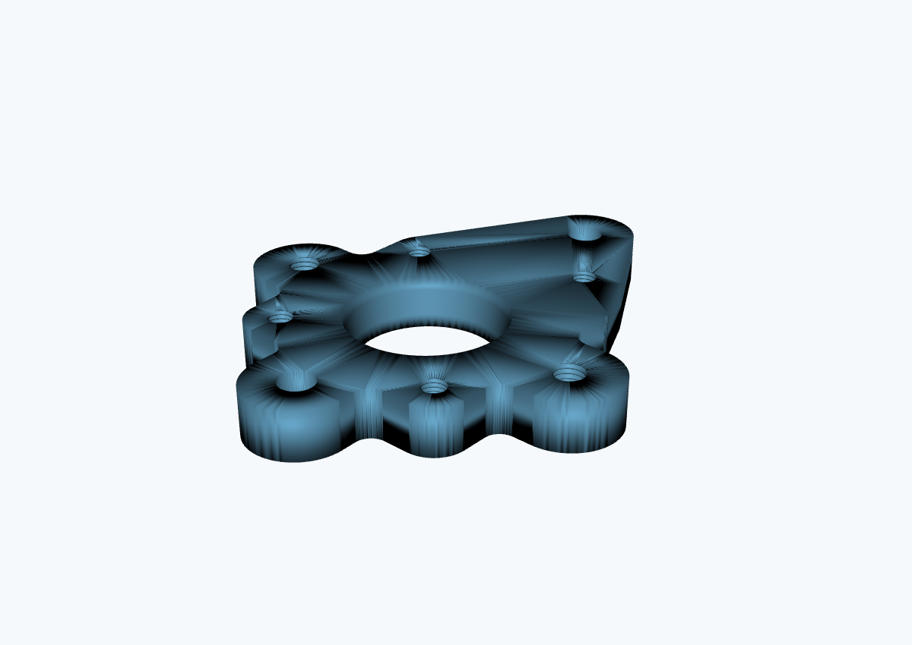

# 1994 Toyota 4Runner | VW ALH TDI Swap & Custom Transmission Control

**Independent mechanical engineering and mechatronics project**  
**Tools:** FreeCAD · KiCad · Arduino platform · CAD/STEP/STL · PCB assembly · Mechanical/electrical integration

I started this project after taking my 1994 Toyota 4Runner off-road and realizing its original 3.0L V6 lacked the power I wanted. I researched drivetrain alternatives and chose to explore integrating a **Volkswagen 1.9L ALH TDI diesel** with the **Toyota A340F four-wheel-drive automatic transmission**. The project combines mechanical design, drivetrain packaging, custom electronics, and vehicle-system integration.

This repository documents **work in progress**, not a completed or road-tested conversion. The engineering design, disassembly, and bench work are being done independently.

## Project at a glance

| Subsystem | Work completed | Next steps |
| --- | --- | --- |
| Engine | Removed the ALH TDI from a donor VW New Beetle and removed the original 4Runner engine. The TDI has run while suspended on an engine hoist. | Engine mounting, installation, and vehicle integration |
| Turbo adapter / packaging | Created FreeCAD models and exported STEP/STL files for custom turbo-related adapters. | Fabrication, fitment checks, and installation |
| Transmission controller | Designed controller circuitry in KiCad; an Arduino-based transmission-controller PCB has been assembled. A schematic and PCB-manufacturing outputs are included. | Document bench validation and add firmware / editable PCB layout |
| Shift-actuation parts | Designed successive servo horn, bracket, housing, and bearing-cap models. | Prototype fit, testing, and refinement |
| Documentation | Maintained dated engineering notes and original design files. | Add annotated project photos, test measurements, and build results |

## Mechanical design


*Turbo-adapter CAD preview rendered directly from an STL model in this repository.*

The mechanical files include native FreeCAD projects (`.FCStd`), neutral CAD exports (`.step`), and tessellated prototype models (`.stl`). The project includes turbo-adapter geometry and transmission servo-actuation components, with revisions retained to show development.

- [Turbo adapter CAD](cad/turbo-adapters/)
- [Transmission actuation CAD](cad/transmission-actuation/)

## Electronics and transmission control

The transmission-control effort focuses on the A340F's shift-related solenoids and supporting vehicle inputs. The repository contains an editable KiCad schematic and a set of Gerber/drill manufacturing outputs.

- [KiCad schematic](electronics/schematic/Solenoid%20control.kicad_sch)
- [Gerber files and drill outputs](electronics/manufacturing/gerbers/solenoid-control/)
- [Electronics file notes](electronics/README.md)

**Important:** The provided archive did not contain an Arduino `.ino` / source-code file or an editable `.kicad_pcb` board-layout file. Those are not represented as already published here. The assembled board has not been documented as validated in the vehicle.

## Repository layout

```text
cad/
  turbo-adapters/                 FreeCAD source, STEP, and STL exports
  transmission-actuation/        Servo/bracket/bearing-related models
  legacy-unlabeled/              Earlier CAD models with ambiguous names
electronics/
  schematic/                      KiCad editable schematic
  manufacturing/gerbers/         One verified set of Gerbers / drill files
software/                         Placeholder and guidance for firmware upload
docs/
  original-development-log.md     Dated notes from earlier work
  project-status.md               Current status and outstanding work
  design-file-guide.md            What files are where and how to open them
assets/previews/                  Visual previews generated from original STL models
```

## Development approach

1. **Research and requirements:** Evaluate a low-speed/off-road drivetrain improvement and needed engine/transmission interfaces.
2. **Design:** Build and revise custom components in FreeCAD and electronics in KiCad.
3. **Prototype:** Produce manufacturing files and assemble the transmission-controller PCB.
4. **Test and integrate:** Check fit, electrical behavior, shifting, temperatures, and reliability before using the vehicle.

Progress is incremental. Photos and performance measurements will be added when available; none are fabricated for presentation.

## Notes and safety

This is a personal educational engineering project. Models, circuitry, and manufacturing outputs are **experimental and unvalidated for road use**; fabrication files may require further dimensional, material, and safety checks. No endorsement or certification is implied.

**Licensing:** No open-source license is granted at this time. Please contact the repository owner before reusing design files.
